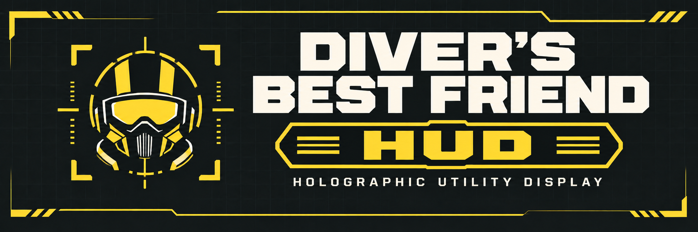

# DBF-HUD

A weapon-mounted ammo, fuel, heat and charge HUD for Helldivers 2. Current development version: **0.3.41**. This is the source checkout; generated releases may lag behind it.

Current weapon-art checkpoint and uninstalled Senator cylinder: [2026-10-03 session notes](docs/SESSION-20261003.md). Source publication does not create a new release or install prototypes.

## Installation

Download the [Complete prerelease](https://github.com/HWG90/DBF-HUD/releases) and install it through Arsenal with Bingus Shared Loader. It includes the HUD, render bridge, fonts and depth assets. MDL is optional for live reload; DBF-MCM is optional for configuration. Bingus Mod Options is not required.

Follow the [Getting Started guide](docs/GETTING_STARTED.md) for requirements, installation, editor controls and presets. Existing local settings are preserved; fresh installations receive the bundled tuned defaults and three starter presets.

## Start here

For a new coding chat, read these in order:

1. [Handoff and current state](docs/HANDOFF.md): current environment, verified behavior, unfinished work and preservation rules.
2. [Architecture](docs/ARCHITECTURE.md): data flow, module responsibilities and safe extension points.
3. [Layout editor and profiles](docs/LAYOUT_EDITOR.md): controls, coordinates, attachment points, scale and persistence.
4. [Development and deployment](docs/DEVELOPMENT.md): build, validation, live reload and troubleshooting.

The linked guides describe the current implementation. Older root research notes are historical records and are not installation instructions.

## Current features

- 72 native font families, selected under **Appearance**.
- Screen-projected weapon panels with scene-depth occlusion.
- Weapon-specific ammo labels and projectile symbols, fire-mode child panels, fuel and heat gauges, and a railgun charge gauge.
- Fixed three-digit numeric slots with dimmed leading zeros; counts above 999 can expand. The single-shot speargun uses one loaded digit.
- Live layout editor with saved per-weapon/per-view position, scale and attachment points.
- Configurable decorations, effects and settings through DBF-MCM.
- Occlusion debug control under **Placement**.
- MDL API 2 lifecycle and live Lua reload.

## Quick development loop

```powershell
python tests/run.py
python tools/build.py
```

The test runner uses the installed game's LuaJIT DLL by default; `--lua-dll` overrides its path. **113 offline contracts pass for this release.** They do not replace an in-game visual check.

Build outputs include `dist/dbf_hud.lua`, `mdl/dbf_hud/mod.lua` and an MDL ZIP in the parent directory. The active loose MDL mod is installed under `%LOCALAPPDATA%/MDL/Helldivers2/Mods/dbf_hud`.

Active configuration lives in Local AppData\DBF. Back it up before manual profile changes; updates preserve existing files.

## Assets and attribution

Lua reload changes code, not compiled engine assets. Native text and decoration depth materials require the deployed combined font/depth package. The native-font update was confirmed working in-game during this session; retained archive versions must still be checked before deployment.

See [MDL lifecycle notes](MDL.md) and the current guides above for development and deployment.

Game binaries, private captures and private testing-tool packages are not project documentation artifacts. Preserve font attribution and terms in `licenses/`. No blanket license is granted for the remaining project code in this snapshot.

## Getting started

[Installation, downloads and first setup](docs/GETTING_STARTED.md).
